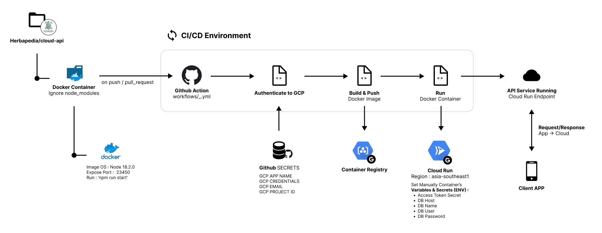
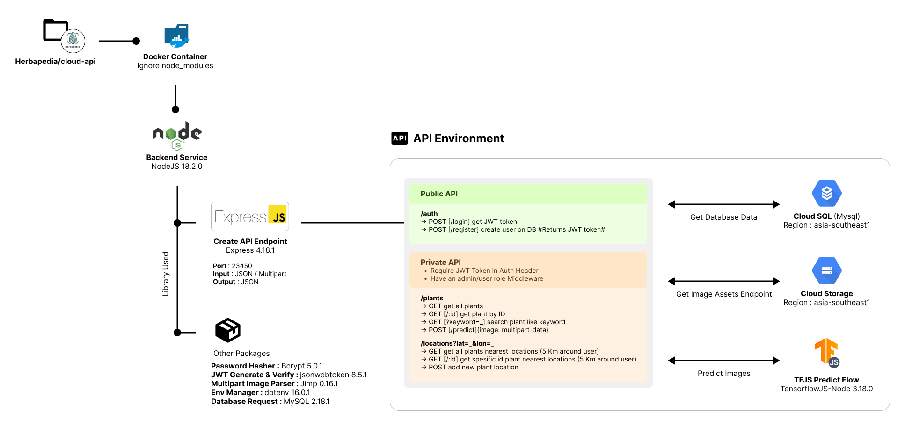

# Herbapedia - Cloud Computing Documentation
[](#)
[]()

## What is Herbapedia
Herbapedia is an Android-based mobile application that is used as a means of educating the public about Indonesian herbal plants. This project is part of the Bangkit 2022 Capstone Project.

## Getting Started
Here are a few steps to get our system up and running in your local computer :
1. **Prequerities** :
    - NodeJS `18.2.0`
    - NPM `8.9.0`
    - Docker `20.10.16`

2. **Initial Setup** :
    - Pull the project on our [Github Repo](https://github.com/herbapedia/cloud-api/actions)
    - Run the command below inside the repo directory to install all the node modules in `package.json`
        ```bash
        $ npm install
        ```
    - Create `.env` file inside the folder, that contains the key below.
        ```txt
        DATABASE_HOST=
        DATABASE_SCHEMA=
        DATABASE_USER=
        DATABASE_PASSWORD=

        ACCESS_TOKEN_SECRET=
        ```
        The DATABASE_ information will be use to connect to your preffered database. The ACCESS_TOKEN_SECRET will be used to hash and verify JWT token.
    - Run the command below inside the repo directory to start the app
        ```bash
        $ npm run start-dev
        ```
        By default the application will run on port `23450`. To change this, open `src/server.js` on the listen arguments.
    - Go ahead and test the app, open [localhost](https://localhost:23450/plants)
3. **Building Docker Container** :
    - Build the docker image
        ```bash
        $ docker build -t herbapedia/local:latest .
        ```
    - Run the docker image in a container
        ```bash
        $ docker run -p 8080:23450 herbapedia/local:latest
        ```
        You can specify the end point here by mapping the `computer`:`container` port , I used 8080 for conveniences.
    - Go ahead and test the app, open [localhost](https://localhost:8080/plants)


## Docker Environment

For the Docker environment, we setup CI/CD development by using GitHub actions. 

Here are Google Services that we use for CI/CD environment :
1. Container Registry : To create the image on GCP
2. Cloud Run : To run and serve the app on GCP. Endpoint will be provided.

Because the .env is ignored, we need to setup the environment variables manually on the Cloud Run  by using `Secrets and Variables` setting. 

The service is currently up and running on this [endpoints](https://herbapedia-umpbwdfpnq-as.a.run.app). To make a request, you need to logged in, by sending auth bearer token in a form of JWT. 

## API Architechture


In the API environemnt, we use express to serve the app. 

We have 3 major routes that can be used, which are :
1. Auth
2. Plants
3. Locations

Each of its function can be found in the image above.


